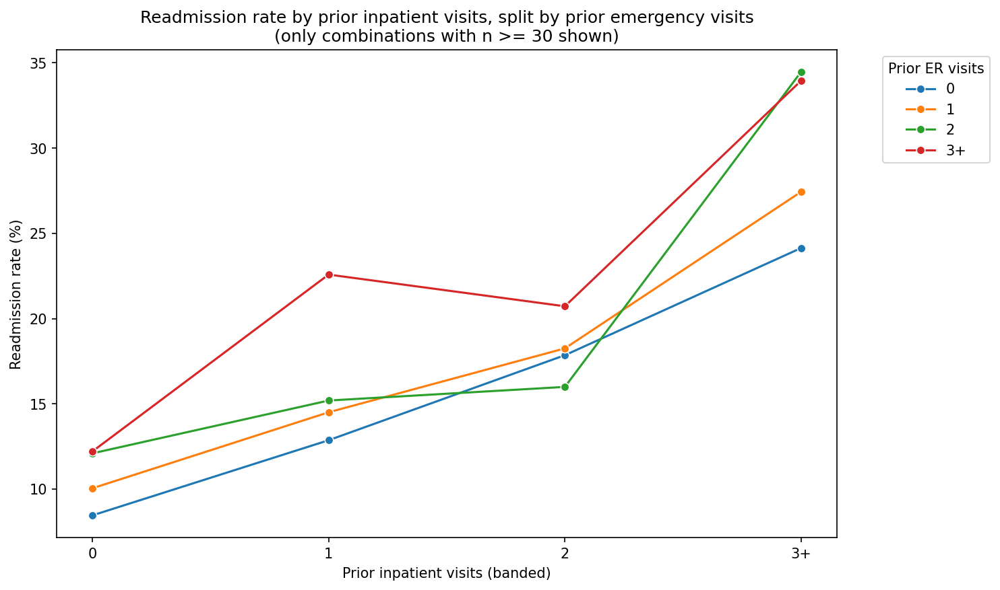
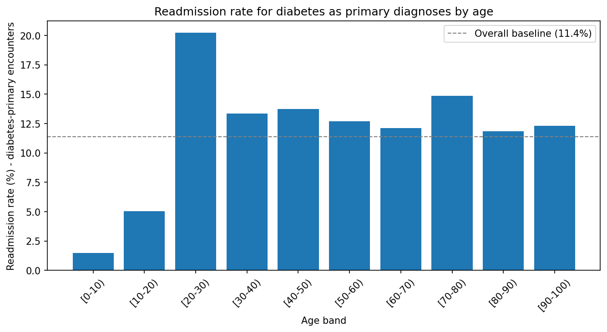
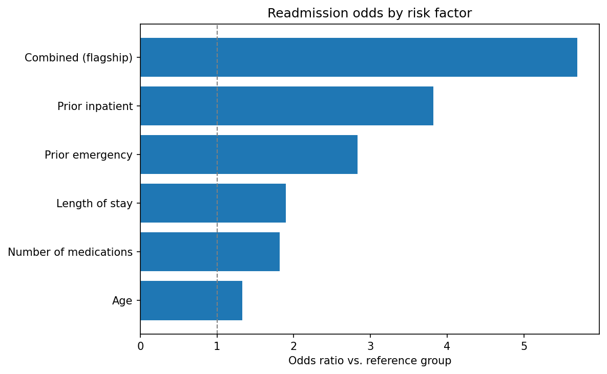

# Hospital Readmissions & Quality Operations — Diabetes 130-US Hospitals

A full-pipeline analytics project examining which encounter-level and utilization factors are associated with 30-day hospital readmission among diabetic patients, framed as an operations/quality-improvement question for a hospital discharge-planning team.

## Business question

Which encounter-level and utilization factors are associated with 30-day readmission, and what should a hospital quality-operations team flag or change in its discharge/follow-up process as a result?

## Dataset

[Diabetes 130-US Hospitals for Years 1999-2008](https://archive.ics.uci.edu/dataset/296/diabetes+130-us+hospitals+for+years+1999-2008) (UCI ID 296) — 101,766 inpatient encounters across 130 US hospitals, 1999–2008.

Raw and generated data files are not committed to this repository (see `.gitignore`) to keep it lightweight. To reproduce the pipeline:
1. Download `diabetic_data.csv` and `IDS_mapping.csv` from the UCI link above.
2. Place them in a local `data/` folder (already gitignored).
3. Run the pipeline as described below — it regenerates the star-schema exports (`fact_encounter.csv`, `dim_diagnosis.csv`, etc.) into the same folder.

## Pipeline

1. **Python (pandas, seaborn)** — cleaning and EDA
2. **Python (scikit-learn, statsmodels)** — logistic regression on 30-day readmission risk, plus an independent replication of Strack et al. (2014)'s published figures
3. **Azure SQL Database** — star schema + analytical queries (`sql/diabetes130_queries.sql`)
4. **Power BI (Power Query + DAX)** — interactive dashboard (`dashboard/readmit_dashboard.pbix`) including a daily risk-flag watchlist

## Running the Python pipelines

The notebook logic has been rewritten into OOP-based Python scripts:

- `eda.py` — EDA pipeline and star-schema exports (`fact_encounter.csv`, `dim_diagnosis.csv`)
- `log_reg.py` — logistic regression pipeline, model exports, and paper-figure recreation
- `recreate_plots_from_strack.py` — recreates the source paper's published figures for cross-validation
- `main.py` — entry point that runs the pipelines end-to-end

Install dependencies and run:

```bash
pip install -r requirements.txt
py main.py
```

All generated plots are saved in `result_plot/`.

## Key findings

- **Prior hospital utilization is the strongest predictor.** Patients with 3+ prior inpatient stays and 2+ prior ER visits in the past year were readmitted at 34.5% — roughly 3x the 11.4% overall baseline. The two factors compound each other rather than just overlapping.
- **Young adults with diabetes are a distinct risk group.** Patients aged 20–30 admitted primarily for diabetes were readmitted at over 20%, nearly double the rate of diabetes patients at any other age — consistent with the known pediatric-to-adult care transition gap in diabetes management.
- **Long stays are only risky when paired with a heavy medication load.** Patients staying 10+ days and discharged on 26+ medications were readmitted at 15%+, the highest rate in the dataset. Neither factor alone shows this effect.
- A logistic regression risk-scoring model (AUC = 0.607) and an accompanying Power BI dashboard operationalize these findings into a daily discharge-planning risk watchlist.
- Findings were independently cross-checked against Strack et al. (2014), the study originally published alongside this dataset (see `reference/`) — model coefficients and key relationships (e.g. HbA1c testing's link to lower readmission risk for diabetes patients) replicated closely.

Full write-up is in [`reports/`](reports/).

### Selected plots

**Prior hospital utilization adds risk:**



**Young adults with diabetes as a primary diagnosis are a distinct risk spike:**



**All risk factors compared on a common scale:**



## Repository structure

```
├── result_plot/        # All generated plots
├── sql/                # Analytical SQL queries and views
├── dashboard/          # Power BI dashboard (.pbix) and theme
├── reports/            # Stakeholder-facing report and dataset description
├── reference/          # Source paper (Strack et al., 2014) and ID mapping lookup
├── data/                # Raw/generated data (gitignored — see Dataset section)
├── eda.py
├── log_reg.py
├── main.py
├── recreate_plots_from_strack.py
├── requirements.txt
└── LICENSE
```

Dashboard: https://app.powerbi.com/groups/me/reports/bd1d7c49-b1f3-44a3-9164-fa29a50a1187/f7653dc2c78539a2d30c?experience=power-bi

## Tools

Python (pandas, seaborn, scikit-learn, statsmodels) · Azure SQL Database · Power BI (Power Query, DAX)

## License

MIT — see [LICENSE](LICENSE).
